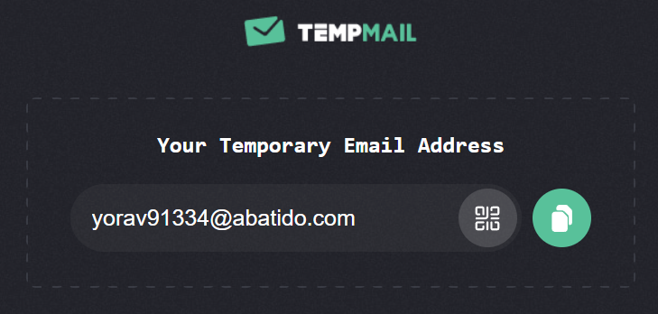
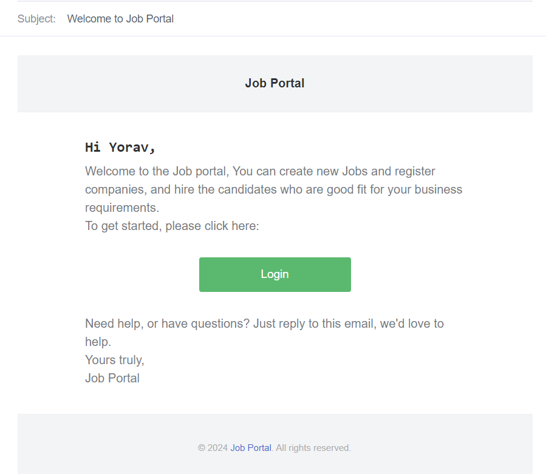
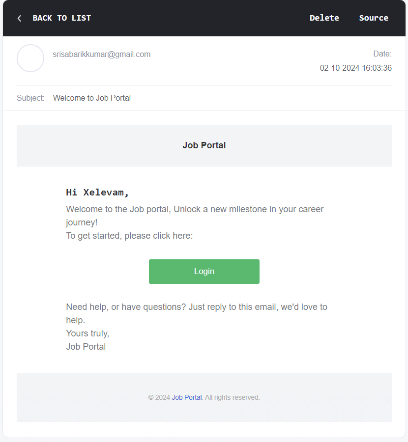
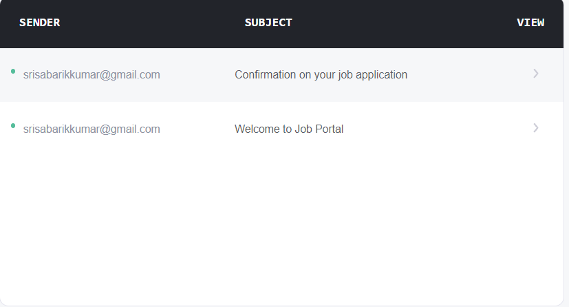
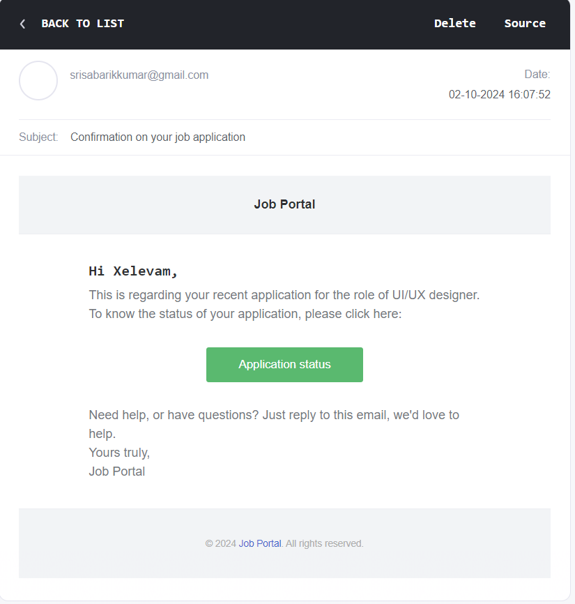
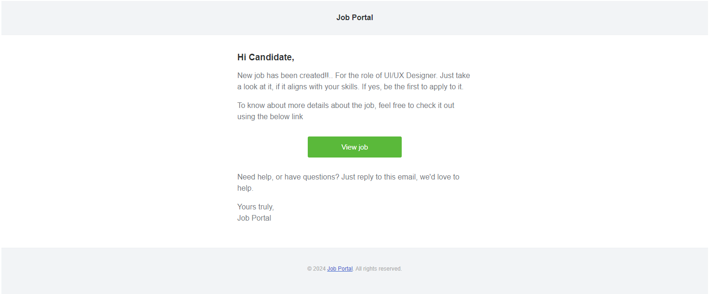

# Job Portal App Frontend

This is a repository of Job portal App created using React, React Router and Redux.

# Technologies Used

* React
* React Router
* Redux
* Tailwind css
* nodejs
* mongoDB

# Getting Started

# 1. Clone the repo

```bash
 git clone https://github.com/your-username/your-frontend-repo-name.git
```

# 2. Install node modules 

```bash
 npm install
```

# 3. Run the development server

```bash
 npm run dev
```

# Accessing the Nodemailer email service using demo credentials

While registering for the first time in this app, users will get the email notification on successful
registeration. And this can be checked by using the random emails, which is generated from the [temp mail](https://temp-mail.org/) website.

# Example notification:

1. Generate a random email like the below example:



2. On successful registeration, the email will be delivered according to the user role,
and it can be seen on the temp mail website:





3. Likewise candidate will get a mail on applying to a job:





4. All the users with candidate role will get a email whenever a new job is posted



# Demo credentials:

# 1. Demo credentials for logging in as a candidate

```bash
 samadog454@aiworldx.com
 samadog@123
```

# 2. Demo credentials for logging in as a admin

```bash
 yiben40716@abatido.com
 yiben@123
```